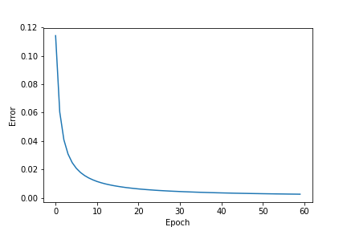
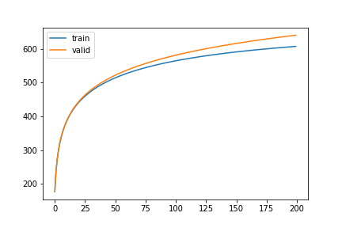

# Book-Recommender-System-RBM
This is an implementation of a Book Recommender System in TensorFlow using Restricted Boltzmann Machines based on the collaborative filtering paradigm.

-----


- Python 3.6 and above
- CUDA 8.0
- Tensorflow (if you don't have GPU access)
- Tensorflow-gpu 1.4.1 (check compatible TensorFlow versions  with the CUDA versions [here](https://www.tensorflow.org/install/source#tested_source_configurations)
- NumPy
- Pandas
- Matplotlib

<center></center>

[Image Source](https://cdn-images-1.medium.com/max/1600/1*cLusB9Kkfaf-EudwtX8ASQ.png)

## Preparing the Goodbooks-10k Dataset

```bash
mkdir data
cd data
wget https://github.com/zygmuntz/goodbooks-10k/blob/master/books.csv
wget https://github.com/zygmuntz/goodbooks-10k/blob/master/ratings.csv
wget https://github.com/zygmuntz/goodbooks-10k/blob/master/to_read.csv
```

## Training the Recommender System

```bash
python3 main.py --data_dir='data' --num_hid=64 --epochs=30 --batch_size=128

# if you want the free energy plot as well
python3 main.py --data_dir='data' --num_hid=64 --epochs=30 --batch_size=128 --free_energy=True
```
**Note**: Training will be very fast with a GPU but you can still run it without a GPU. Make sure to not select a large number of rows (default = 200000) as you may get Out of Memory error for a large tensor allocation.

### Command help
```bash
# to see all the arguments for training and getting recommendations
python3 main.py --help

usage: main.py [-h] [--num_hid NUM_HID] [--user USER] --data_dir DATA_DIR
               [--rows ROWS] [--epochs EPOCHS] [--batch_size BATCH_SIZE]
               [--alpha ALPHA] [--free_energy FREE_ENERGY] [--verbose VERBOSE]

optional arguments:
  -h, --help            show this help message and exit
  --num_hid NUM_HID     Number of hidden layer units (latent factors)
  --user USER           user id to recommend books to (not all ids might be
                        present)
  --data_dir DATA_DIR   path to dataset
  --rows ROWS           number of rows to be used for training
  --epochs EPOCHS       num of training epochs
  --batch_size BATCH_SIZE
                        batch size
  --alpha ALPHA         learning rate
  --free_energy FREE_ENERGY
                        Export free energy plot
  --verbose VERBOSE     Display info after each epoch
```

## What are Restricted Boltzmann Machines?

**Note**: A detailed explanation on RBMs can be found on my [blog post](https://adityashrm21.github.io/Restricted-Boltzmann-Machines/).

RBMs are two-layered artificial neural network with generative capabilities. They have the ability to learn a probability distribution over its set of input. RBMs were invented by Geoffrey Hinton and can be used for dimensionality reduction, classification, regression, collaborative filtering, feature learning and topic modeling.

RBMs are a special class of [Boltzmann Machines](https://en.wikipedia.org/wiki/Boltzmann_machine) and they are restricted in terms of the connections between the visible and the hidden units. As stated earlier, they are a two-layered neural network (one being the visible layer and the other one being the hidden layer) and these two layers are connected by a fully bipartite graph. This means that every node in the visible layer is connected to every node in the hidden layer but no two nodes in the same group are connected to each other. This restriction allows for more efficient training algorithms than are available for the general class of Boltzmann machines, in particular the [gradient-based](https://en.wikipedia.org/wiki/Gradient_descent) contrastive divergence algorithm.


A Boltzmann Machine             |  A Restricted Boltzmann Machine
:-------------------------:|:-------------------------:
  |  

## Why use RBMs for recommendation?

RBMs are unsupervised learning algorithms which try to **reconstruct** user input and in order to achieve this, they try to learn patterns from the examples in our data. This is then used to create a lower-dimensional representation of the pattern which can later be used to reconstruct approximations of the original input. Their ability to do this makes them a good fit for our problem because we need the algorithm to identify a pattern (the reading taste of a user) from the input and reconstruct it in the form of a score for each book (a rating essentially). This ultimately would help us in providing recommendations to that user based on the reconstructed scores.

<center></center>

[Image Source](https://image.slidesharecdn.com/mlss2014xamatriain-140721124307-phpapp02/95/recommender-systems-machine-learning-summer-school-2014-cmu-72-638.jpg?cb=1405946863)

### Training Error Graph

This graph was obtained on training the data for 60 epochs with a mini-batch size of 100:



## Deciding number of Epochs

<center></center>

The plot shows the average free energy for training and the validation dataset with epochs.

If the model is not overfitting at all, the average free energy should be about the same on training and validation data. As the model starts to overfit the average free energy of the validation data will rise relative to the average free energy of the training data and this gap represents the amount of overfitting. So we can determine the number of epochs to run the training for using this approach. Looking at the plot, we can safely decide the number of epochs to be around **25**.

-----

**Feel free to open issues or contribute in any way you like!**

For a detailed tutorial on how to build this system, read my blog post on [Building a Recommender System using Restricted Boltzmann Machines](https://adityashrm21.github.io/Book-Recommender-System-RBM/). For information on RBMs, read [my blog post on Demystifying RBMs](https://adityashrm21.github.io/Restricted-Boltzmann-Machines/).

#### Sources/References:
* [Wikipedia - Restricted Boltzmann Machines](https://en.wikipedia.org/wiki/Restricted_Boltzmann_machine)
*  https://github.com/srp98/Movie-Recommender-using-RBM
* [Guide on training RBM by Geoffrey Hinton](https://www.csrc.ac.cn/upload/file/20170703/1499052743888438.pdf)
* https://skymind.ai/wiki/restricted-boltzmann-machine
* https://www.cs.toronto.edu/~rsalakhu/papers/rbmcf.pdf
* [Artem Oppermann's Medium post on understanding and training RBMs]( https://towardsdatascience.com/deep-learning-meets-physics-restricted-boltzmann-machines-part-ii-4b159dce1ffb)
